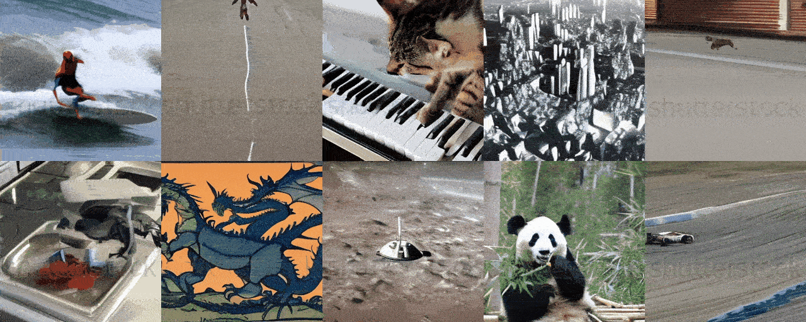
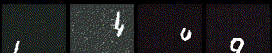
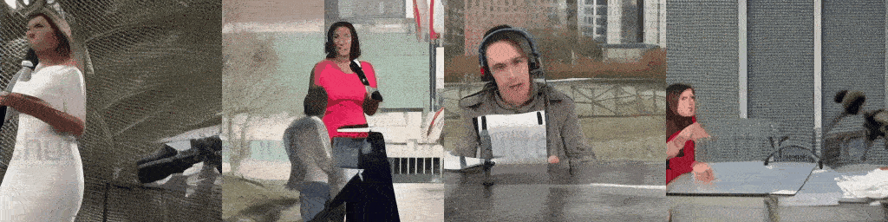

<div align="center">

<!-- omit in toc -->
# Train Tiny SORA
  
     

</div>

This repository contains a video diffusion model implementation in PyTorch similar to what is described in the technical report of original sora model [here](https://openai.com/index/video-generation-models-as-world-simulators/). Scripts can be used to train a model from scratch or further fine-tune a pre-trained model on a custom dataset.

Following are some results of the model trained on a (non commercial) shutterstock and (open source) msrvtt dataset for 10k Epochs, trained on a single GPU for 4 days:

Prompt: **A person holding camera**


Prompt: **Spaceship crossing the bridge**


Output of model trained on **moving mnist dataset** for **600 Epochs**:



Prompt: **News reporter talking**




<!-- omit in toc -->
## Table of Contents
- [Training Data Info](#training-data-info)
- [Prerequisites](#prerequisites)
- [Code Structure](#code-structure)
- [Training](#training)
- [Inference](#inference)
- [Parameters](#parameters)
- [References](#references)
- [Contributing](#contributing)


## Training Data Info

You can use any annotated video dataset to train the model. The training data should be in the form of gifs with corresponding text descriptions. Below is the sample of the training data:

```python
# if your training data exist under /training_data directory

training_data/
|── video1.gif
|── video1.txt
|── video2.gif
|── video2.txt
...
```

where `video1.gif` is the video file and `video1.txt` is the text description of the video. The text description should be a single line of text describing the video content. for example:

| video1.gif (32x32)  | video1.txt |
|------|------------|
|  | A person is driving |

You can use the `src/data_generation/msrvtt.py` script to load the [MSRVTT](https://paperswithcode.com/dataset/msr-vtt) dataset or the `src/data_generation/synthetic_object.py` script to generate synthetic object data for training the model. The [MSRVTT](https://paperswithcode.com/dataset/msr-vtt) dataset is a large-scale video description dataset with 10,000 video clips and 200,000 sentences. The synthetic object data is generated using the `src/data_generation/synthetic_object.py` script and consists of simple object animations with corresponding text descriptions.


## Prerequisites

Make sure you have a basic understanding of object-oriented programming (OOP), neural networks (NN) and PyTorch to understand the code. Below are some resources to help you get started:

| Topic               | Video Link                                                |
|---------------------|-----------------------------------------------------------|
| OOP                 | [OOP Video](https://www.youtube.com/watch?v=Ej_02ICOIgs&pp=ygUKb29wIHB5dGhvbg%3D%3D) |
| Neural Network      | [Neural Network Video](https://www.youtube.com/watch?v=Jy4wM2X21u0&pp=ygUbbmV1cmFsIG5ldHdvcmsgcHl0aG9uIHRvcmNo) |
| Pytorch             | [Pytorch Video](https://www.youtube.com/watch?v=V_xro1bcAuA&pp=ygUbbmV1cmFsIG5ldHdvcmsgcHl0aG9uIHRvcmNo) |

## Code Structure

The codebase is organized as follows:
```bash
train-tiny-sora/
├── configs/
│   └── default.yaml          # Configuration file for training parameters and hyperparameters
├── src/
│   ├── architecture/
│   │   ├── __init__.py       # Makes the architecture directory a Python package
│   │   ├── attention.py      # Contains the Attention and EinopsToAndFrom classes for attention mechanisms
│   │   ├── blocks.py         # Contains Block, ResnetBlock, and SpatialLinearAttention classes (building blocks for the UNet)
│   │   ├── common.py         # Contains common layers and utilities used in the architecture
│   │   ├── unet.py           # Contains the main Unet3D model definition
│   │   └── relative_position_bias.py   # Contains the RelativePositionBias class for positional encoding.
│   ├── data_generation/
│   │   ├── msrvtt.py        # Contains the MSRVTT class for loading the MSRVTT dataset
│   │   └── synthetic_object.py   # Contains the SyntheticObject class for generating synthetic object data
│   ├── data/
│   │   ├── dataset.py        # Defines the Dataset class for loading and preprocessing video data
│   │   └── utils.py          # Utility functions for handling video and image data.
│   ├── diffusion/
│   │   ├── __init__.py       # Makes the diffusion directory a Python package
│   │   └── gaussian_diffusion.py  # Contains the GaussianDiffusion class, which implements the diffusion process
│   ├── text/
│   │   └── text_handler.py   # Functions for handling text input using a pre-trained BERT model (tokenization, embedding)
│   ├── trainer/
│   │   └── trainer.py        # Contains the Trainer class, which handles the training loop, optimization, EMA, saving, and sampling
│   └── utils/
│       └── helper_functions.py   # General-purpose helper functions (exists, noop, is_odd, default, cycle, etc.)
├── train.py                  # Main training script: loads config, creates model, diffusion, trainer, and starts training
├── generate.py                  # Main generation script: loads config, creates model, diffusion, trainer, and starts generation 
└── requirements.txt          # Lists the required Python packages for the project
```

`train.py` is the main script for training the Tiny SORA model. It loads the configuration from `configs/default.yaml`, creates the model, diffusion process, and trainer, and starts the training loop. The `generate.py` script is used for generating videos from text prompts using the trained model. The `src` directory contains the source code for the model architecture, data generation, diffusion process, text handling, and training utilities. The `requirements.txt` file lists the required Python packages for the project.

## Training

Clone the repository and navigate to the directory:
```bash
git clone https://github.com/FareedKhan-dev/train-text2video-scratch.git
cd train-text2video-scratch
```

if you encounter any issues regarding the imports, make sure to change pythonpath to the root directory of the project:
```bash
export PYTHONPATH="${PYTHONPATH}:/path/to/train-text2video-scratch"

# or if you are already in the train-text2video-scratch directory
export PYTHONPATH="$PYTHONPATH:."
```

create a virtual environment and activate it:
```bash
python3 -m venv env
source env/bin/activate
```

Install the required dependencies:
```bash
pip install -r requirements.txt
```

You can modify the architecture under `src/architecture/` and the training parameters under `configs/default.yaml` to suit your needs. The default configuration file contains hyperparameters for training the model.

We already have a data_generation script that generates synthetic object data or loads the MSRVTT dataset. You can use this script to generate training data for the model. The data generation script is located at `src/data_generation/synthetic_object.py` and `src/data_generation/msrvtt.py`.

data_generation script will generate training data under the default directory `training_data/`. You can modify the script to generate data in a different directory.

Once you have the training data, you can start training the model using the `train.py` script:
```bash
python train.py
```

The script will load the configuration from `configs/default.yaml`, create the model, diffusion process, and trainer, and start the training loop. The model checkpoints and logs will be saved in the default directory `./saved_models/`.

You can modify the configuration file to change the training parameters, such as the learning rate, batch size, number of epochs, etc.

## Inference

To generate videos from text prompts using the trained model, you can use the `generate.py` script:
```bash
python generate.py --text "A cat is dancing"
```

The script will load the same configuration used for training, create the model, diffusion process, and generate a video from the input text prompt. The generated video will be saved in the default directory `./results/`.

Following parameters can be passed to the `generate.py` script:
- `--model_path`: Path to the trained model checkpoint (.pt file).
- `--output_dir`: Directory to save the output GIF.
- `--text`: Text prompt for video generation.
- `--batch_size`: Batch size for video generation.
- `--cond_scale`: Conditioning scale for diffusion sampling.

## Parameters

For the model architecture, the following parameters can be modified:

| Parameter                  | Value                          | Description |
|----------------------------|--------------------------------|-------------|
| `dim`                      | 64                             | Dimensionality of the model (embedding size) |
| `use_bert_text_cond`       | True                           | Enables BERT-based text conditioning for model input |
| `dim_mults`                | `[1, 2, 4, 8]`                 | Scaling factors for each model block (increasing depth) |
| `init_dim`                 | `null`                         | Initial dimension, not specified |
| `init_kernel_size`         | 7                              | Kernel size for initial layers |
| `use_sparse_linear_attn`   | True                           | Enables sparse attention mechanism for efficiency |
| `block_type`               | "basic"                        | Type of model block (e.g., 'basic', 'resnet', etc.) |

For the diffusion process, the following parameters can be modified:

| Parameter                 | Value      | Description |
|---------------------------|------------|-------------|
| `image_size`              | 32         | Height and width of the video frames |
| `num_frames`              | 5          | Number of frames in the video sequence |
| `timesteps`               | 10         | Number of diffusion timesteps used during training |
| `loss_type`               | "l1"       | Loss function for optimization ('l1' means L1 loss) |
| `use_dynamic_thres`       | False      | Whether to use dynamic thresholding during training |
| `dynamic_thres_percentile`| 0.9        | Threshold percentile used for dynamic thresholding |

For the training process, the following parameters can be modified:

| Parameter                   | Value        | Description |
|-----------------------------|-------------|-------------|
| `ema_decay`                 | 0.995       | Exponential moving average decay rate for model weights |
| `train_batch_size`          | 2           | Number of samples per batch during training |
| `train_lr`                  | 0.0001      | Learning rate for training |
| `train_num_steps`           | 10000       | Total number of training steps (epochs) |
| `gradient_accumulate_every` | 1           | How often to accumulate gradients (1 means no accumulation) |
| `amp`                       | False       | Whether to use automatic mixed precision for training |
| `step_start_ema`            | 2000        | Step at which to start applying EMA smoothing |
| `update_ema_every`          | 10          | Frequency of updating EMA weights (every 10 steps) |
| `save_model_every`          | 10          | Save model every 10 steps |
| `results_folder`            | "./saved_models" | Folder where results (models, samples) are saved |
| `num_sample_rows`           | 4           | Number of rows to display during sampling (visualization) |
| `max_grad_norm`             | `null`      | Maximum gradient norm for clipping (null means no clipping) |


## References

- [OpenAI SORA Technical Report](https://openai.com/index/video-generation-models-as-world-simulators/)
- [MSRVTT Dataset](https://paperswithcode.com/dataset/msr-vtt)
- [PyTorch](https://pytorch.org/)
- [Hugging Face Transformers](https://huggingface.co/transformers/)
- [Lightning AI For GPU Resources](https://lightning.ai/)


## Contributing

Contributions are welcome! Please feel free to submit a pull request or open an issue if you encounter any problems or have any suggestions for improvement.
